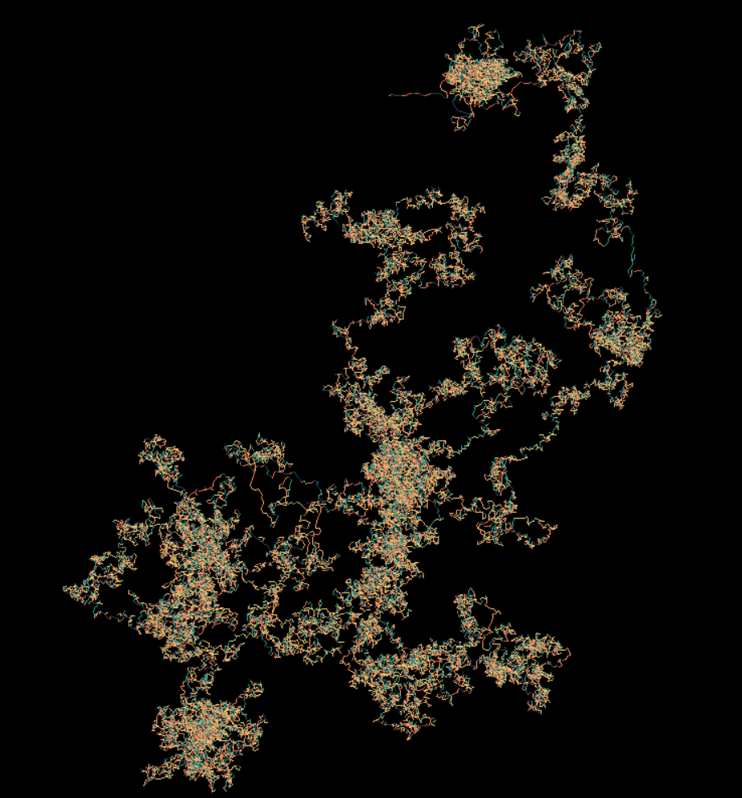

# Aperiodic Monotile Random Walk

This visulisation is a random walk of the positions of tiles from the weakly chiral aperiodic monotile Tile(1, 1), or 'spectre' tile.

*A random walk with 5 tile iterations*

*The spectre tiling*

## How it works

1. The tiling is generated the same way that it is in [this web app](https://cs.uwaterloo.ca/~csk/spectre/app.html) and [this repository](https://github.com/shrx/spectre).
2. Each time a tile is drawn, the average postion of all its vertices is added to a list.
3. For each position $`(x, y)`$ in the list, the calculation $`(x × y) \bmod 360`$ is performed to produce and angle between 0 and 360 degrees.
4. A line of arbitary length is then drawn at this angle from the end position of the previous line. The colour of the line is based on the angle to which it is drawn.
5. This process is repeated until a line has been drawn for each tile.

In summary, the positions of each tile from the tiling of the spectre monotile are converted into angles by multiplying the x and y coordinates and computing the remainder when divided by 360. Lines are then iteratively drawn at these angles.

Read the original research paper of the spectre monotile [here](https://arxiv.org/pdf/2305.17743.pdf) and the hat monotile [here](https://arxiv.org/pdf/2303.10798.pdf).