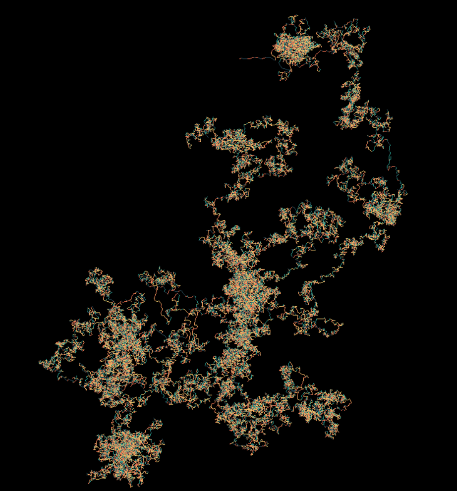
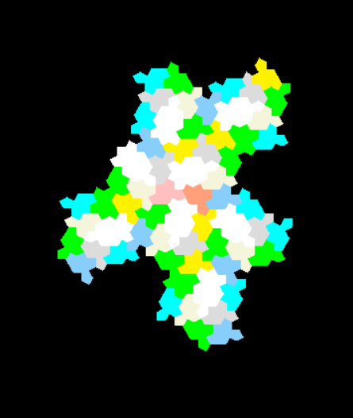

# Aperiodic Monotile Random Walk

A random walk with 5 tile iterations:

The spectre tiling:

This visulisation is a random walk of the positions of tiles from the weakly chiral aperiodic monotile Tile(1, 1), or 'spectre' tile tilings.

The tiling is generated the same way that it is in [this web app](https://cs.uwaterloo.ca/~csk/spectre/app.html) and [this repository](https://github.com/shrx/spectre).
Each time a tile is drawn, its the average postion of all its vertices is added to a list.
For each position in the list, the product of the x and y coordinates is calculated modulo 360 to produce and angle between 0 and 360 degrees.
A line of arbitary length is then drawn at this angle from the end position of the previous line. The colour of the line is based on the angle to which it is drawn.

In summary, the positions of each tile from the tiling of the spectre monotile are converted into angles by multiplying the x and y coordinates and computing the remainder when divided by 360. Lines are then iteratively drawn at these angles.